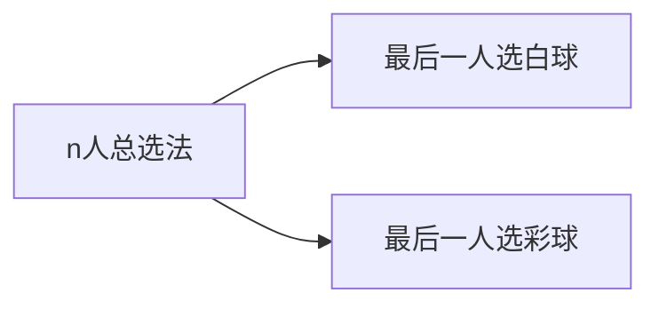
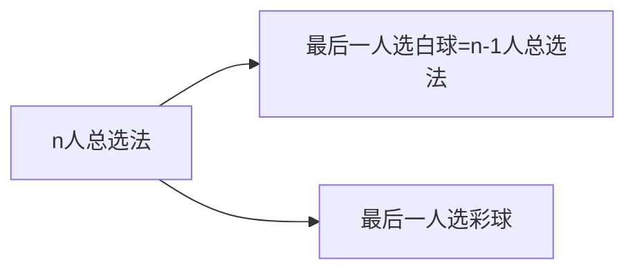
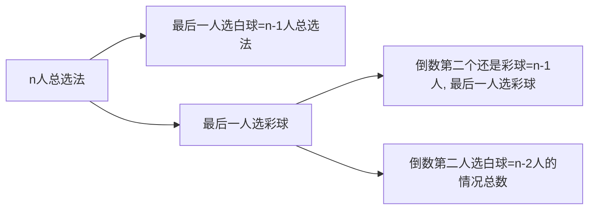

# 构造递推数列解决排列组合问题(上)

构造递推数列是解决排列组合问题的一个重要方法.

例题:

六个人排成一列, 每人在红, 黄, 蓝, 白, 黑五种颜色的球中选一个(每种颜色的球足够多), 要求任意相邻的两个人所选的球或者同色, 或者至少有一个为白色, 满足条件的选球方式数为___.

分析这道题时, 我们先从最后一个选球的人开始考虑起, 选法有其他颜色/白色两种.

如果最后一个人选的球是白色, 那么前面的人又有两种情况; 如果最后一个人选的球是其他颜色, 那么对于倒数第二个人, 还需要分是“同色”还是“白色”的情况.

如果要全部分类讨论, 一定是没完没了的.

让我们用递推的方式解决这个问题.

设$S_n$表示有n个人时满足条件的选球方式总数, 

$a_n$表示有n人, 且最后一个人选的是白球的选球方式总数, 

$b_n$表示有n人, 且最后一个人选的不是白球的选球方式总数.

则有:$S_n=a_n+b_n$

现在考虑如果最后一人选白球的情况, 那么去掉这个白球, 前面所有球仍然满足条件, 所以n-1人满足条件的情况总数等于有n人, 且最后一人选白球的情况总数, 即$a_n=S_{n-1}$.

现在考虑最后一个球是彩色球的情况: 

如果倒数第二个人选的球是白色的, 那么去掉最后两个球对剩余n-2个球是否满足条件不影响, 考虑到末尾的彩球有4种颜色(选法), 所以乘以4.

如果倒数第二个人选的球是彩色的, 那么又要分两种情况考虑, 就相当于考虑n-1人, 最后一人选彩色球的情况总数.

即$b_n=4\cdot S_{n-2}+b_{n-1}$.

$$
\begin{cases}
S_n=a_n+b_n\\
a_n=S_{n-1}\\
b_n=4\cdot S_{n-2}+b_{n-1}
\end{cases}
$$

有这个递推数列之后, 不妨用人少的情况验证.

通过枚举可以得到

$a_1=1, b_1=4, S_1=5\\a_2=5,b_2=8, S_2=13$

代入递推式验证, 发现是正确的.

通过上面的方程组算出$S_n$的递推公式: $S_n=2S_{n-1}+3S_{n-2}$

接下来, 可以算出$S_6=1093$

所以,  满足条件的选球方式数为1093.