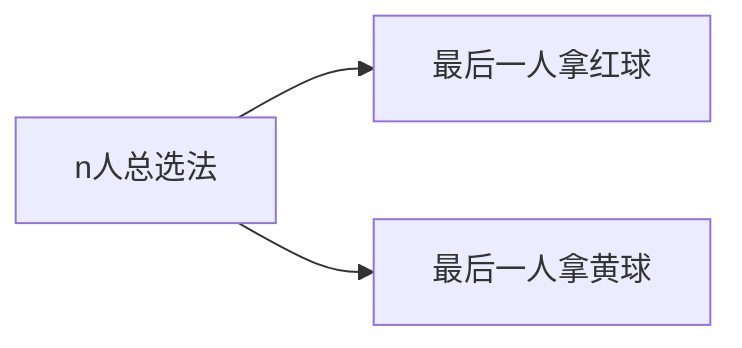
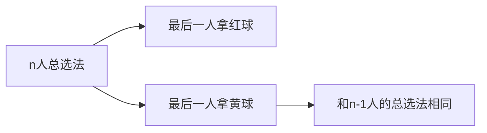
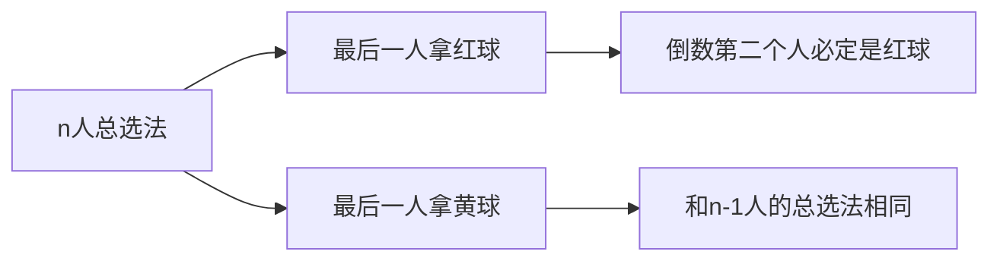
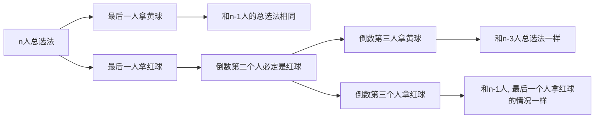

# 构造递推数列解决排列组合问题(下)

我们再来看一个构造递推数列解决排列组合问题的例子:

10个人排成一排, 每人在红, 黄两种颜色的球中选一个(两种颜色的球足够多), 要求拿红球的人的身边至少也有一个拿红球的人. 共有多少种满足条件的排列方法?

仿照上一题, 我们构造递推数列解决问题.

设$S_n$表示有n个人时满足条件的选球方式总数, 

$y_n$表示有n人, 且最后一个人拿着黄球的选球方式总数, 

$r_n$表示有n人, 且最后一个人拿着红球的选球方式总数, 

则有:$S_n=r_n+y_n$

先来讨论最后一个人选的球的情况: 

如果最后一个人拿着的球是黄色的, 那么排除这个人不考虑, 前面的人的排列方式仍然是满足条件的. (因为黄球不必和黄球或红球相邻)

所以我们有: $y_n=S_{n-1}$

但如果最后一个人拿着红球, 由于题目要求拿着红球的人身旁的人也一定要拿红球, 因此倒数第二个人也拿着红球.

那么如果最后一个人拿红球, 倒数第二个人拿着红球, 倒数第三个人呢? 这时候又分拿红球和拿黄球的情况了.

如果是拿黄球, 那么去掉最后三个人, 对前面的排列是否满足条件没有影响.

如果是拿红球, 那么有连续三个人拿红球, 去掉最后一个人也不影响前面的排列是否满足条件.

用数列公式表达就是:$r_n=r_{n-1}+S_{n-3}$
$$
\begin{cases}S_n=r_n+y_n\\y_n=S_{n-1}\\r_n=r_{n-1}+S_{n-3}\end{cases}
$$

由这个方程组可以推出递推公式: $S_n=2S_{n-1}-S_{n-2}+S_{n-3}$

但需要注意的是需要计算出$S_1,S_2,S_3$之后才能开始递推, 最后得到$S_{10}=200$