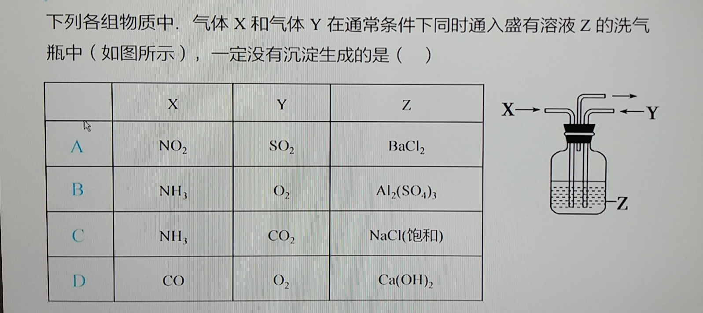
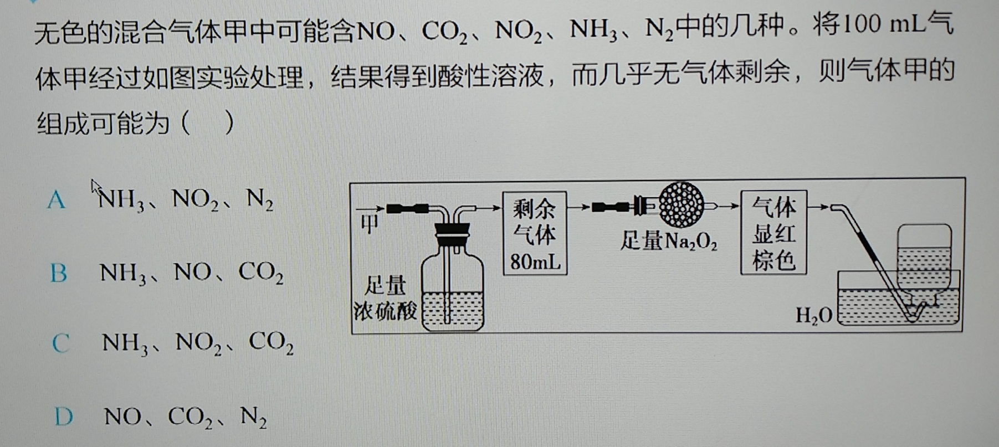

这是是“秋天的金枪鱼”的第1份稿件, 作者为“秋天的金枪鱼”的“南外”, 提供两道化学选择题的解答.

A选项: 二氧化硫通入溶液中,形成亚硫酸. 硝酸根在酸性条件下具有氧化性, 把亚硫酸氧化成硫酸（二氧化氮与水反应生成硝酸）, 硫酸与氯化钡反应生成硫酸钡沉淀. 排除.

B选项: 铝离子和氨水反应生成氢氧化铝沉淀. 排除.

C选项: 侯氏制碱法生成碳酸氢钠沉淀. 排除.

故选D.

因为输入无色气体，故A、C中红棕色的二氧化氮不符题意, 排除.

二氧化碳通过过氧化钠生成氧气, 氧气与一氧化氮生成二氧化氮, 氨气通过浓硫酸生成硫酸铵，即气体被吸收. 

氮气则可能存在. 

故选最合理的答案为B

