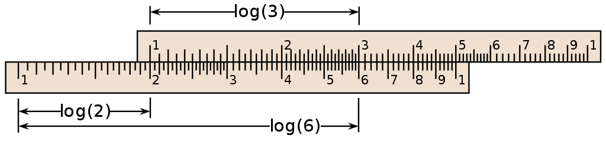
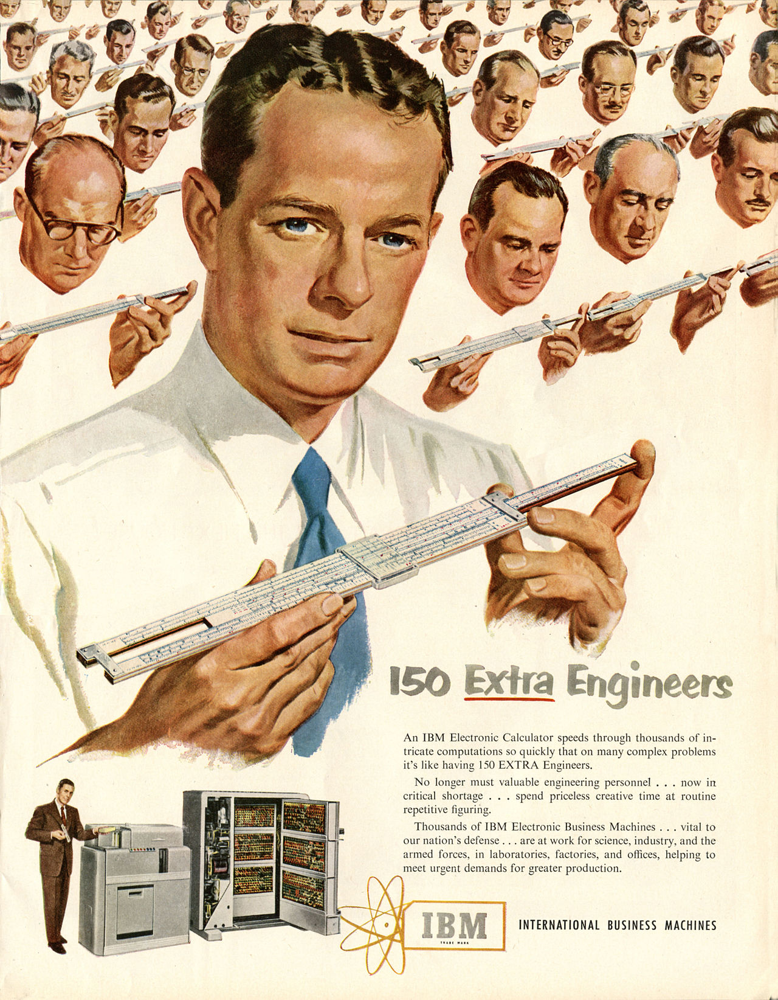

## 对数篇(5) 计算尺

上回分解:

原式可以化简为:

log22x=log2(x-a)2

于是乎我们就可以得到, 在2x>0, (x-a)2>0的限制条件下, 当2x=(x-a)2有一个实数根时a满足条件.

也即是说2x=(x-a)2有一个大于0的实根.

这里推荐标答里两边开根号, 把a用x表示出来然后配方解的方案(比起直接拆省去很多不必要的讨论).

最后得到a∈{-1/2}∪[0, +∞)

---

在卡西欧、TI这些电子计算器遍地开花前, 有一种计算工具曾经统治了人类三百余年, 而这种工具的出现正是基于对数的发明. 这种工具就是计算尺.

如图<small>(引用自维基百科(CC-BY-SA 3.0)</small>,计算尺的刻度并不是线性的, 而是在lgX处标上X. 

计算尺利用的就是对数的两个运算性质.

比如若我们要计算182乘以212, 把滑尺(人们常说的C尺)刻度的182对齐固定部分的X(人们常说的D尺)

然后去D尺上的212处读, 可以读到在386附近, 根据估算, 212乘以182约等于38600 (实际答案是38584,没差多少)

当我们在使用计算尺估算的时候, 实际上是把绿色这一段和紫色这一段相加.

**本质是$\log(1.82)+\log(2.12)\approx\log(3.86)$**

反之亦然, 除法亦能计算.

有了乘除法的对应后, 人们又在计算尺上加上了三角比的对应等等, 计算尺成为了一个绝佳的计算(或是估算, 毕竟现实中没必要那么精准)工具.

然而, 计算尺还是有缺陷:

首先它(因为刻度上没有位数之分)不能帮你算出结果有几位, 所以积/商的大致范围还得要由使用者估算.

其次, 它不能直接计算加减法, 需要先把加减法转化成乘除法再计算.

固然计算尺不会死机, 也高度标准化所以不需要独立的说明书, 但显然计算尺无法适应时代了. ~~不过作为作文素材还是很不错的.~~

上图(1951年)IBM的广告就用一种震撼人心的手法向大家阐释了计算器比起计算尺的强大计算力. 然而广告并不是在说明人会被机器取代, 而是告诉大家: 计算器取代计算尺, 是把富有创造力的工程师们从冗杂的体力劳动中解放出来. 回想起前辈们挑着油灯, 拿着计算尺, 翻着八位对数表苦算之岁月, 我由衷想到, 我们能生活在这个卡西欧遍地开花的时代实属幸运.

>  对数篇·完