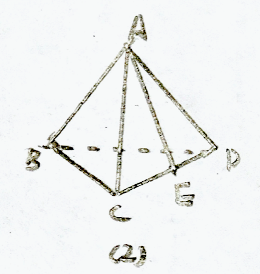

# 那些学完就忘的立体几何#4 (异面直线所成角计算)

如果我们要在多面体中求异面直线所成角, 我们可以通过构造出一个与异面直线所成角大小相等(或互补)的平面上的角, 并计算它的大小, 以此得出异面直线所成的角的大小. ~~话说读的时候这句话怎么断句啊~~

根据~~题目又多又难的~~高中数学精编上的建议, 解这种立体几何计算题要按照“作、证、算”三步. 对于本专题, “作”直接反映高阶思维, “证”展现逻辑能力和条理性, “算”则无外乎餘弦定理、畢氏定理这些方法, 不过体力活耳! (开玩笑的, 计算也很重要)

今天我们来看两道例题.

话说回来, 其实作图是做立体几何题时很重要的步骤! 老师也说什么画好图就是做好了一半的题.~~然而我第七感不够, 画图也画不好, 而且嫌麻烦所以不写什么作图经验, 但其实作图是非常重要的!~~

---

例题一:

已知AB, BC, CD为不在同一平面内的三条线段, AB, BC, CD的中点为P, Q, R, 满足PQ=2, QR=√5, PR=3, 求AC与BD所成的角.

$联结AC, BD$
$在三角形ABC中:$
$\frac{BP}{AB}=\frac{BQ}{BC}$
$\implies PQ//AC$
$同理, QR//BD$
$\therefore AC与BD所成的角等于\angle PQR(或其补角)$
$\because QR=\sqrt{5}=\sqrt{PQ^2+PR^2}$
$\therefore \triangle PQR为Rt\triangle, \angle PQR=90^\circ$
$\therefore AC与BD所成的角为90^\circ$

本题中, 我们通过~~题目自带的平行以及~~等角定理把AC与BD所成的角转换为某一三角形的内角, 由此算出异面直线的所成角.

---

例题二:

在正四面体ABCD中, 若E为棱CD的中点, 求AE与BC所成角的余弦值.

设AC=1, 取BD中点P, 联结PE, AP.

PE是三角形DBC的中位线, 所以BE//PE. 所以AC与BE所成角即为∠AEP(或其补角)

在三角形APE中, AP=√3/2, AE=√3/2, PE=1/2 (通过勾股定理以及中位线性质计算得出)

由余弦定理, cos∠AEP=√3/6

故AC与BE所成角的余弦值即为√3/6

本题中, 我们构造了一个三角形, 使得其中的一个内角等于异面直线所成角.

---

练习:

在正四面体ABCD中, 若E,F分别为棱CD, AD的中点, 求AF与CE所成角的正切值. (不提供详解)

在空间四边形ABCD中, 已知AD=1, BC=√3, 且AD⊥BC, 对角线BD=√(13)/2, AC=√3/2, 求AC和BD所成的角. (不提供解答)